<p align="center">
  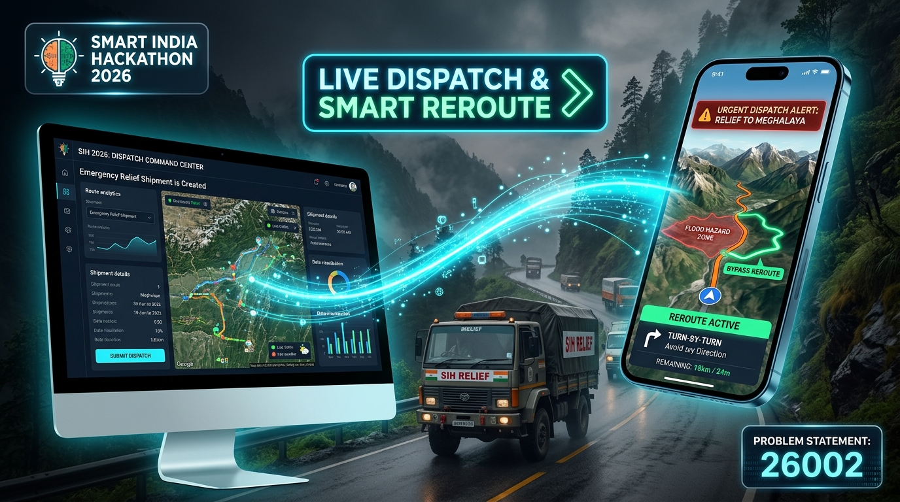
</p>

# NERLIMS: AI-Based Smart Logistics and Accessibility Intelligence Platform for the North Eastern Region (NER)

NERLIMS (North East Region Logistics & Incident Management System) is an integrated, artificial-intelligence-driven disaster logistics, route accessibility monitoring, and predictive supply intelligence command platform engineered specifically for the 8 states of Northeast India: Assam, Arunachal Pradesh, Meghalaya, Manipur, Mizoram, Nagaland, Tripura, and Sikkim.

The platform bridges central disaster authorities, state logistics bureaus, emergency relief truck drivers, and ground field officers into a unified, synchronized operational ecosystem during extreme weather emergencies and infrastructure disruptions.

---

## Problem Statement Details

- **Event:** Smart India Hackathon 2026
- **Problem Statement ID:** 26002
- **Problem Statement Title:** AI-Based Smart Logistics and Accessibility Intelligence Platform for North Eastern Region (NER)
- **Organization:** Ministry of Development of North Eastern Region (MDoNER)
- **Department:** Ministry of Development of North Eastern Region (MDoNER)
- **Category:** Software
- **Theme:** Transportation & Logistics

---

## The Problem: Logistics and Accessibility Challenges in NER

The North Eastern Region of India faces chronic and severe logistics bottlenecks caused by its complex topography, vulnerable arterial highways, extreme monsoon downpours, and cloudburst-induced geohazards:

- **Single Arterial Highway Vulnerabilities:** Lifeline corridors such as NH-715 (Brahmaputra South Bank), NH-29 (Assam-Nagaland connector), and NH-2 (Imphal Corridor) pass through floodplains and steep hill cuts. A single breach or landslide isolates entire districts and states within hours.
- **Severe Supply Chain Disconnects:** Transportation of critical commodities—such as emergency medicines, cold-chain vaccines, food grains (PDS), POL fuel (diesel/petrol), and disaster shelter kits—frequently suffers days of delays, escalating regional deficits.
- **Lack of Predictive Situational Intelligence:** Traditional logistics systems rely on reactive reporting after roads are already submerged or blocked. There is no automated mechanism to forecast corridor breaches 72 hours in advance or calculate localized supply depletion thresholds.
- **Last-Mile Coordination Gaps:** Field relief truck drivers lack real-time hazard warnings in truck cabs, often navigating directly into submerged causeways or active mudslide zones without verified bypass alternatives.
- **Terrain and Connectivity Barriers:** Severe cellular deadzones across Himalayan valleys impede conventional web reporting, requiring resilient offline synchronization and regional multilingual speech telemetry.

---

## The Solution: NERLIMS Platform Overview

NERLIMS solves these systemic vulnerabilities through an end-to-end, multi-tier operational architecture:

1. **Predictive AI Risk Modeling:** Machine learning engines (XGBoost) ingest continuous precipitation, soil moisture, and river runoff metrics from Open-Meteo and OpenWeather APIs to calculate road severance risks up to 72 hours in advance.
2. **Predictive Supply Intelligence (Sphere 2018 Standards):** Automatically audits district-level stockpiles against international humanitarian minimum standards, quantifying exact buffer deficits and mobilizing required truck convoys before physical cutoffs occur.
3. **Interactive 3D GIS Command Center:** A WebGL-accelerated 3D vector map providing real-time GPS fleet tracking, interactive hazard geofences, isolated district telemetry, and corridor topology analytics.
4. **Autonomous Heavy-Vehicle Rerouting:** OpenRouteService (ORS) HGV avoidance-polygon engine dynamically computes flood-free bypass corridors (e.g., Kolia Bhomora Setu NH-715A and NH-15 North Bank) around active hazard perimeters.
5. **Mobile Driver Navigation App:** An authentic turn-by-turn GPS navigation client with real-time maneuver guidance, automatic 3-second emergency dispatch ingestion, and in-cab hazard warnings.
6. **Multilingual Speech-to-GIS Field Telemetry:** Ground disaster officers report road washouts by speaking naturally in Assamese, Bengali, Hindi, or English; Google Gemini AI transcribes and structures geo-tagged incident reports in real time.

---

## Key Features

- **Predictive 72-Hour Highway Risk Forecasting:** Machine learning algorithms predict landslide and flash flood road breaches using real-time atmospheric precipitation and geographical gradient models.
- **Sphere 2018 Humanitarian Standard Compliance:** Automated deficit calculation for water, nutritional caloric requirements, medical supplies, and shelter kits tailored to district population metrics.
- **Real-Time GPS Fleet Tracking & Telemetry:** Continuous live telemetry of relief carriers including vehicle speeds, current headings, distance-to-hazard countdowns, and cargo manifest tracking.
- **Dynamic Hazard Geofencing:** Autonomous creation of spatial hazard polygons that immediately halt inbound vehicles and trigger bypass calculations.
- **Automated Cross-Platform Dispatch Synchronization:** Emergency shipment manifests created at headquarters are transmitted wirelessly to mobile driver units in under 3 seconds.
- **Offline-First Resilience:** Local caching ensures turn-by-turn navigation and incident reporting remain operational during complete cellular service loss.
- **One-Touch Emergency SOS:** Instant distress beacon transmitting GPS coordinates, vehicle registration, and driver telemetry to state emergency response centers.

---

## Interactive Workflows (Mobile Demonstration)

### Autonomous In-Transit Hazard Detection and Bypass Rerouting

The workflow below demonstrates the complete lifecycle of the NERLIMS Mobile Driver Application: operating in standby at Guwahati Logistics Base, receiving an automated 3-second mission alert from Central Command, commencing GPS turn-by-turn navigation along NH-715, intercepting a live flood breach geofence at Kaziranga pass, automatically halting movement, previewing the flood-free Northern Highland Bypass, and accepting the reroute.

<p align="center">
  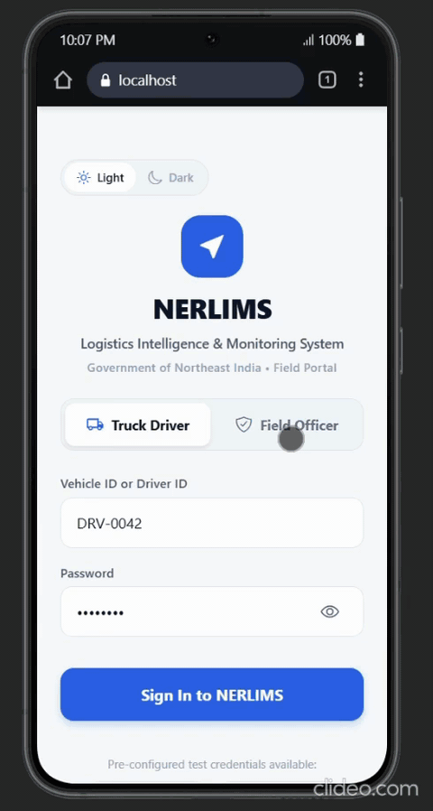
</p>

*The application guides the driver through Google Maps-style turn maneuvers, calculates distance-to-next-turn, and recalculates trajectories using OpenRouteService heavy-goods-vehicle avoidance polygons.*

---

## Web Command Center Interfaces

### 1. Executive Operations Overview
Centralized situational command displaying regional accessibility ratings, active fleet deployments, isolated district indicators, and real-time transit telemetry across all 8 Northeast states.

<p align="center">
  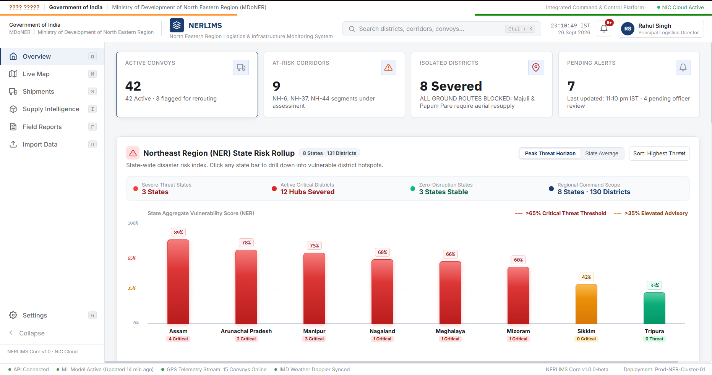
</p>

### 2. 3D GIS Vector Command Map
MapLibre GL 3D vector map rendering high-resolution satellite imagery, topographic relief, active convoy vectors, flood hazard perimeters, and isolated district markers (such as Majuli causeway severance).

<p align="center">
  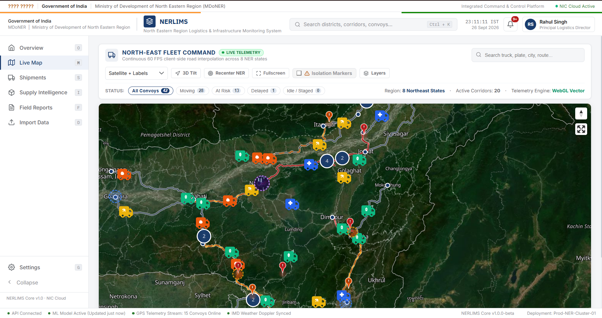
</p>

### 3. Predictive Supply Intelligence & Strategic Reserves
Audit of essential commodities (Medicines, Food Grains, Fuel, Materials) across all 8 states with Sphere 2018 humanitarian deficit modeling and 1-click state-to-district drilldown drawers.

<p align="center">
  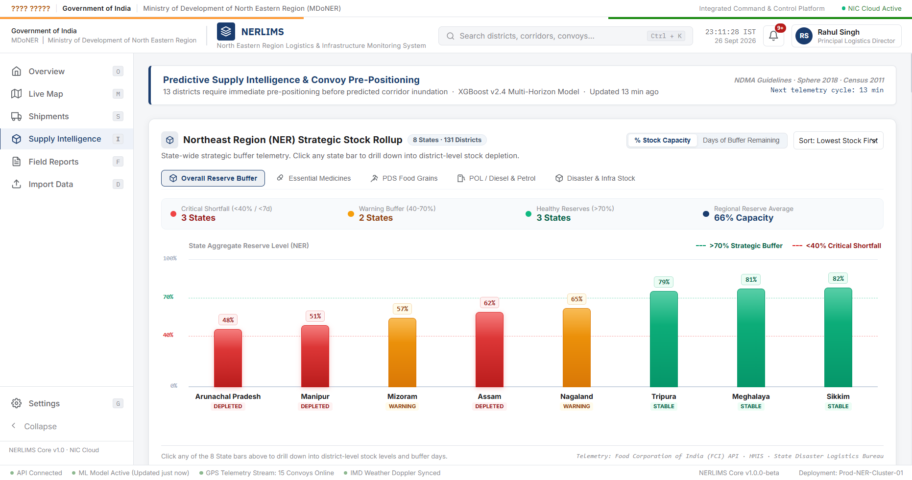
</p>

### 4. Emergency Shipment Creation & Fleet Dispatch
Automated logistics manifest generator calculating corridor distances, estimated travel durations, driver assignments, and instant wireless transmission to the mobile application.

<p align="center">
  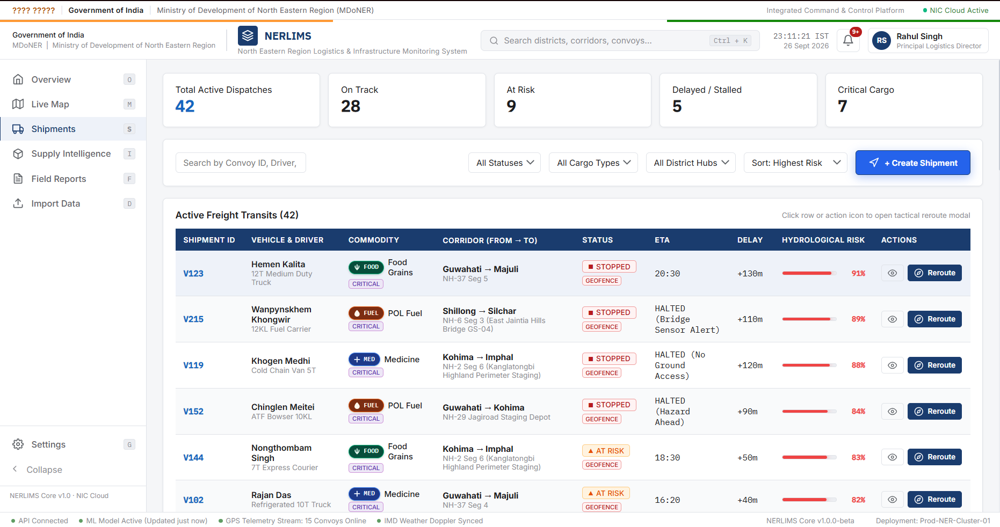
</p>

### 5. Central Incident Management & Field Telemetry
Real-time ingestion feed aggregating geo-tagged incident reports, road damage severity scores, and photo telemetry submitted by field disaster officers across the region.

<p align="center">
  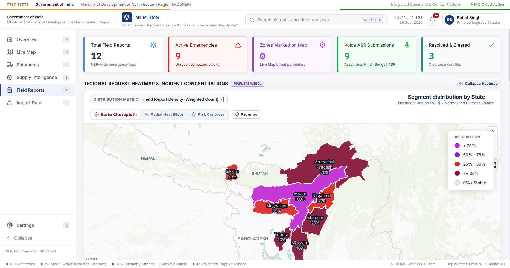
</p>

---

## Mobile Application Interfaces (Driver & Field Officer)

<div align="center">

| Driver Authentication | Turn-by-Turn GPS HUD | Driver Profile & Vehicle | Field Officer Incident Report |
| :---: | :---: | :---: | :---: |
| 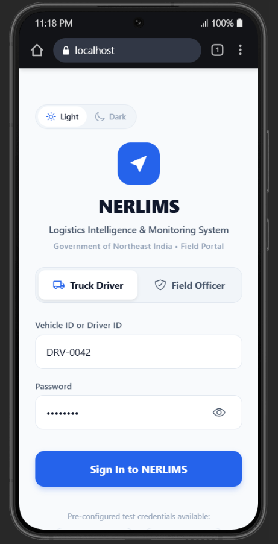 | 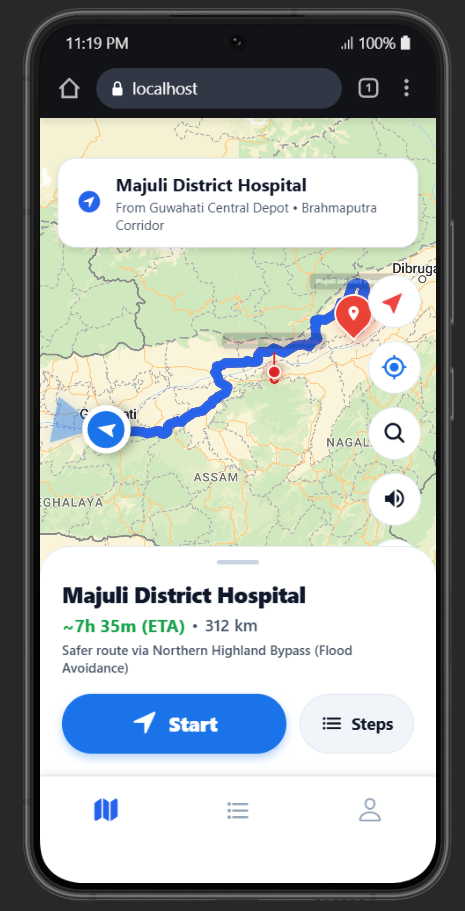 | 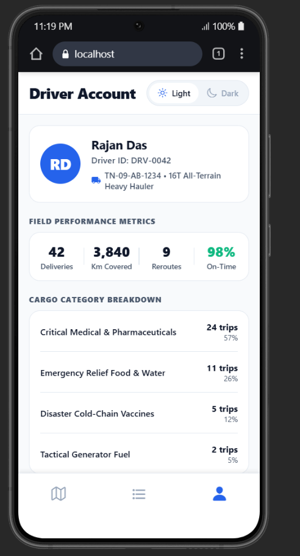 | 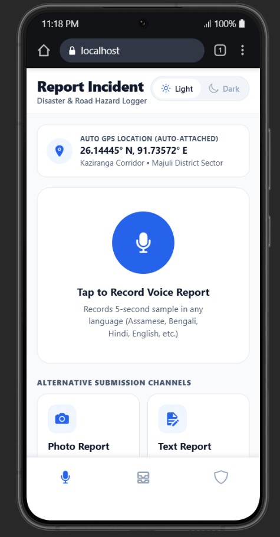 |

</div>

---

## Technical Architecture

NERLIMS operates a distributed multi-tier architecture connecting the Central Web Command Center, the Mobile Driver Client, meteorological prediction pipelines, and routing engines:

```
  +-----------------------------------------------------------------------------------------+
  |                               Central Web Command Center                                |
  |                         (React 18 / Vite / MapLibre GL 3D WebGL)                        |
  +--------------------+-------------------+--------------------+------------------------+
                       |                   |                    |
       [72h Weather]   |   [GIS Routing]   |   [Fleet Dispatch] |   [Incident Telemetry]
                       v                   v                    v                    v
  +--------------------+--+  +-------------+------+  +----------+---------+  +-------+------+
  |  Open-Meteo & Weather |  |  OpenRouteService  |  | Local Bridge Server|  | Google Gemini|
  |  Live Climate Feeds   |  |  HGV Avoid-Polygons|  | Node.js / Broadcast|  | Multilingual |
  +--------------------+--+  +-------------+------+  +----------+---------+  | Speech API   |
                       |                   |                    |            +-------+------+
                       |                   |                    |                    |
                       +-------------------+--------------------+--------------------+
                                           |
                                           v
  +-----------------------------------------------------------------------------------------+
  |                           Mobile Client (Driver & Field Officer)                        |
  |                          (React Native / Expo SDK 52 / TypeScript)                      |
  |                                                                                         |
  |  - Authentic Turn-by-Turn HUD          - Automatic 3-Second Dispatch Ingestion          |
  |  - Autonomous Hazard Geofence Alert    - Multilingual Voice Incident Logging            |
  |  - Highland Bypass Route Preview       - Emergency One-Touch SOS Beacon                 |
  +-----------------------------------------------------------------------------------------+
```

### End-to-End Operational Flow:
1. **Atmospheric Data Ingestion:** Weather micro-services pull real-time precipitation, 72-hour forecast rain rates, and soil saturation indices from Open-Meteo and OpenWeather APIs.
2. **Machine Learning Risk Assessment:** The XGBoost inference engine evaluates slope stability and hydrological factors along National Highways to output segment-level breach probabilities.
3. **Sphere Standard Audit:** The supply engine computes district inventories against Sphere minimum standards (e.g., 2,100 kcal/person/day for food; 15 liters/person/day for clean water; essential antibiotics and antivenom buffer tiers).
4. **Emergency Dispatch Transmission:** Headquarters operators generate mission manifests. The Node.js Bridge Server and BroadcastChannel bus beam encrypted payloads to field devices within 3 seconds.
5. **Driver Navigation & In-Cab Rerouting:** The mobile client tracks real-time location. When entering a geofenced danger zone, it automatically halts vehicle movement and requests an alternate route from OpenRouteService using dynamic `avoid_polygons`.
6. **Ground Officer Speech Processing:** Remote field personnel record voice incident reports in native regional languages. Google Gemini AI processes the audio and extracts structured JSON containing the disaster type, impassable roadway, and geo-coordinates.

---

## Machine Learning & Routing Engine Specifications

### 1. XGBoost Highway Severance Classifier
- **Model Type:** Extreme Gradient Boosting (XGBoost) Classifier / Regressor
- **Features:** 24h cumulative rainfall (mm), 72h forecast precipitation intensity (mm/h), terrain slope angle (degrees), soil moisture saturation index (%), elevation differential (m), and river proximity distance (m).
- **Target:** Probability score of highway transit severance [0.0 to 1.0].
- **Thresholds:** Healthy (<0.40), Warning (0.40 to 0.69), Critical Severance (>=0.70).

### 2. OpenRouteService Heavy-Goods Vehicle (HGV) Routing
- **Profile:** `driving-hgv` (configured for all-terrain heavy transport trucks with axle weight and height constraints).
- **Avoidance Mechanism:** Dynamic GeoJSON avoidance polygons (`avoid_polygons`) injected into routing requests to prevent trajectories through active disaster perimeters.
- **Bypass Route Implementation:** Automatic diversion via Kolia Bhomora Setu (NH-715A) and NH-15 North Bank corridor during Kaziranga South Bank (NH-715) flood inundations.

### 3. Sphere Project Humanitarian Standard Formulations
- **Food Reserves:** Minimum 2,100 kilocalories per person per day, converted to metric tonnage of food grains per district population over buffer target periods (14 to 30 days).
- **Medical Reserves:** Essential cold-chain antivenom vials, ORS packets, IV fluids, and basic trauma supplies scaled by flood vulnerability index.
- **Petroleum, Oil & Lubricants (POL):** Fuel reserves required to power emergency hospital generators and support local relief watercraft.

---

## Technology Stack

- **Web Command Platform:** React 18, Vite, Vanilla CSS, MapLibre GL, WebGL Shaders, Turf.js
- **Mobile Application:** React Native, Expo SDK 52, Expo Router, Leaflet WebGL Engine
- **Artificial Intelligence:** Google Gemini Multilingual Audio AI (Assamese, Bengali, Hindi, English), XGBoost Risk Modeling
- **Routing & Navigation:** OpenRouteService (ORS) HGV Avoid-Polygon Engine, OpenStreetMap Road Vectors
- **Data Protocols & Interoperability:** Node.js Bridge Server (Port 3000), BroadcastChannel API, RESTful Endpoints
- **Humanitarian Guidelines:** The Sphere Handbook (Humanitarian Charter and Minimum Standards in Humanitarian Response)

